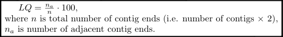
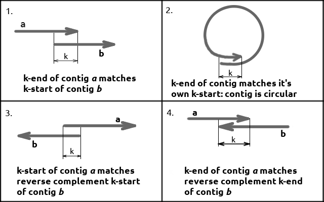
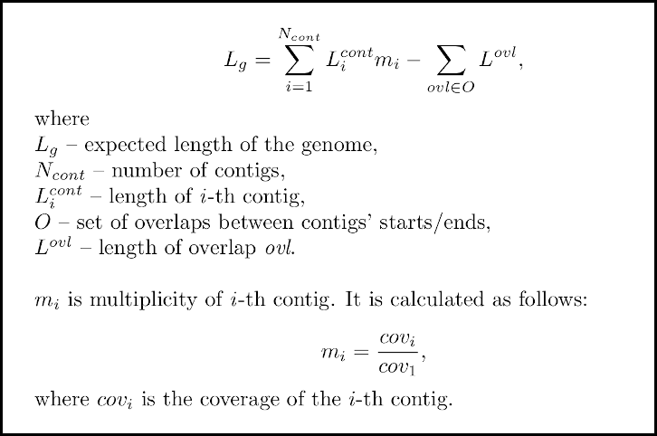
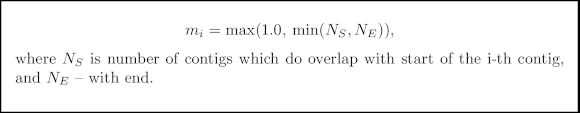

# combinator-FQ2

Combinator-FQ2 is a tool for detecting adjacent contigs and calculating the LQ coefficient. The LQ coefficient reflects the degree of linkage between contigs. The higher the LQ coefficient, the more linked the contigs are.

Combinator-FQ2 is a Rust re-implementation of a deprecated [combinator-FQ](https://github.com/masikol/combinator-FQ), which was written in Python.

Latest version: `1.0.0`.

## Description

Combinator-FQ2 identifies adjacent contigs in order to facilitate further scaffolding.

Format of input: multi-fasta file containing contigs (e.g. generated by [SPAdes](https://github.com/ablab/spades) or [A5](https://doi.org/10.1093/bioinformatics/btu661) assemblers).

It calculates the **LQ coefficient** defined as follows:



Length of overlap is further referred to as *k*. *k-start* (*k-end*) denotes contig's prefix (suffix) of length *k*.

Ends of contigs are considered adjacent in following situations:



combinator-FQ2 calculates expected genome size length as follows:



If no coverage information is present in sequence headers, multiplicity is calculated based on discovered overlaps of the i-th contig as follows:



## Installation

### Download a binary from GitHub

For Linux amd64 systems, please go to [Releases](https://github.com/masikol/combinator-FQ2/releases) and download the latest executable.

### Install using Cargo

First, install [Cargo](https://doc.rust-lang.org/cargo/getting-started/installation.html).

Install the latest version of combinator-FQ2

```bash
cargo install combinator_fq2
```

Install the specific version (say, 1.0.0)
```bash
cargo install combinator_fq2@1.0.0
```

### Build from source

First, install [Cargo](https://doc.rust-lang.org/cargo/getting-started/installation.html).

Then, download an archive with sorce code of a release and extract it. Let’s assume you’vs extracted the archive to the `combinator-fq2/` directory.

Then, run the following:

```bash
# Then go to the extracted directory
cd combinator-fq2
# Optionally: run autotests
cargo test
# Build the binary
cargo build --release
# Check the binary: should show the help message
./target/release/combinator_fq2 --help
```

## Explanation of output files

Combinator-FQ2 generates 3 output files:

### 1) Table containing information about contigs adjacency:

    <prefix>_combinator_adjacent_contigs.tsv

Format of table is following:

```
#  Contig name  Length  Coverage  GC(%)  Multiplicity  Annotation  Start         End
1  NODE_1...    304356  93.7155   34.12  1.2           [empty]     [S=E(NODE_22); ovl=127]  [E=rc_E(NODE_26); ovl=99]
...
```
Explanation of "Start" and "End" columns:

- `[S=E(NODE_22); ovl=127]` means that k-start (`S`) of contig `NODE_1...` is identical to k-end (`E`) of contig `NODE_22`, and overlap length is 127 (`ovl=127`).

- `[E=rc_E(NODE_26); ovl=99]` means that k-end of contig `NODE_1...` is identical to reverse complement (`rc_`) k-end of contig `NODE_26`, and overlap length is 99 (`ovl=99`).

### 2) File, in which all matchings (not only adjacency-associated) are listed:

    <prefix>_combinator_full_matching_log.txt

### 3) Brief summary:

    <prefix>_combinator_summary.txt

## Options

```
-h / --help: print help message;

-v / --version: print version;

-i / --mink: minimum k (in b.p.) to consider.
  Value: integer > 0; Default if 21 b.p.

-a / --maxk: maximum k (in b.p.) to consider.
  Value: integer > 0; Default is 127 b.p.

-k / --k-mer-len: exact k (in b.p.).
  If specified, '-i' and '-a' options are ignored.
  Value: integer > 0; Option is disabled by default;

-o / --outdir: output directory;
  Default value: 'combinator-result'
```

## Examples

### Use as a binary

```bash
  ./combinator-FQ2 contigs.fasta -k 127 -o outdir/
```

```bash
  ./combinator-FQ2 another_contigs.fa.gz -i 25 -a 300 -o outdir/
```

### Use as Rust library
```rust
use std::path::PathBuf;

use combinator_fq2::{Args, ContigRecord, detect_adjacent_contigs};

let make_contig = |name: &str, start: &str, end: &str| ContigRecord {
    name: name.to_string(),
    length: start.len(),
    gc_content: 50.0,
    coverage: None,
    start: start.to_string(),
    rcstart: String::new(),
    end: end.to_string(),
    rcend: String::new(),
    multiplty: None,
};

// contig_1's end is identical to contig_2's start (14 bp).
let contigs = vec![
    make_contig("contig_1", "ATGCATGCATGCAT", "GATCGATCGATCGA"),
    make_contig("contig_2", "GATCGATCGATCGA", "TTTTTTTTTTTTTT"),
];

let args = Args {
    mink: 5,
    maxk: 14,
    input_fpath: PathBuf::from(""),
    outdir_path: PathBuf::from(""),
    force: false,
};

let overlaps = detect_adjacent_contigs(&contigs, &args);

let ovl = &overlaps.get(&0)[0];
assert_eq!(ovl.contig_i, 0);
assert_eq!(ovl.contig_j, 1);
assert_eq!(ovl.ovl_len, 14);
```
